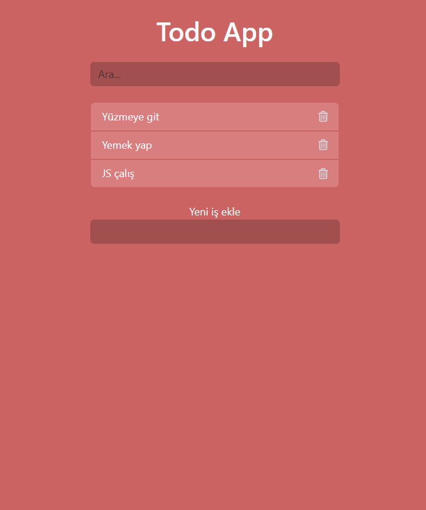

# To_Do_App (JS)

This is a simple To-Do List application built using HTML, CSS, and JavaScript. It allows you to add, remove, and search tasks.
## Features

- Add new tasks to the list.
- Search within tasks.
- Remove tasks from the list.
- Responsive design for both desktop and mobile.

